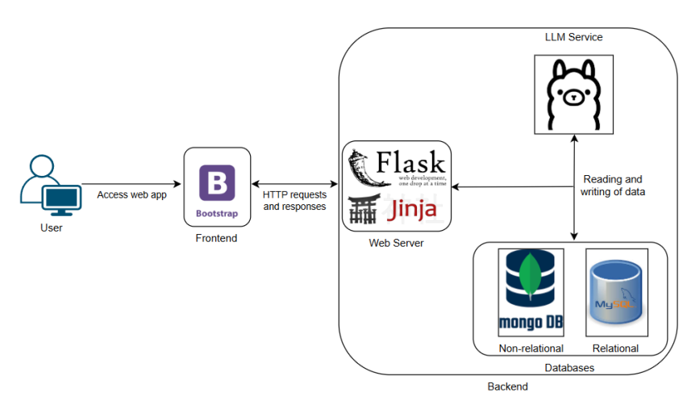

# Architecture

This page describes Hackergram's runtime components and how a request (including one that passes through the LLM) flows through the system. It complements the [Hackergram Overview](labs/hackergram.md), which
describes the application's *functionality*; this page describes its *structure*.

!!! note "Source code"
    This companion site (`netexperiments/websecurity`) contains only documentation. The Hackergram
    application itself lives in its own repository,
    [netexperiments/hackergramlab](https://github.com/netexperiments/hackergramlab){:target="_blank"}:
    [`hackergram.py`](https://github.com/netexperiments/hackergramlab/blob/main/hackergram.py){:target="_blank"},
    [`views.py`](https://github.com/netexperiments/hackergramlab/blob/main/views.py){:target="_blank"},
    [`models.py`](https://github.com/netexperiments/hackergramlab/blob/main/models.py){:target="_blank"},
    and [`templates/`](https://github.com/netexperiments/hackergramlab/tree/main/templates){:target="_blank"}.
    These links currently point at `main`; they will be repointed to the `v1.0` tag once it is created.

!!! info "Which LLM each exercise uses"
    Hackergram serves two 7B models locally through Ollama. `/leaderboard` ([LLM-mediated SQL
    Injection](labs/attacks/llm-mediated-sqli.md)) uses **Llama 2**; `/generate_post` ([Indirect Prompt
    Injection](labs/attacks/indirect-prompt-injection.md), [System Prompt
    Leakage](labs/attacks/system-prompt-leakage.md)) and `/ai_summarize` ([LLM-mediated Stored
    XSS](labs/attacks/llm-mediated-stored-xss.md)) use **Mistral**. See [LLM Setup](llm-setup.md) for the
    exact tags and inference settings.

## Components

/// caption
Hackergram architecture.
///

- **Browser / client**:  the victim-browser and attacker-browser used throughout the lab. Renders whatever
  HTML `views.py` returns, including any LLM-generated markup that reached the page unsanitized (see
  [LLM-mediated Stored XSS](labs/attacks/llm-mediated-stored-xss.md)).
- **Flask backend (`hackergram.py`)**:  the application entry point; referenced directly in
  [Clickjacking](labs/attacks/clickjacking.md) (where response headers are set) and
  [SSRF](labs/attacks/ssrf.md) (as a file an attacker can read via the vulnerable fetch).
- **`views.py`**:  route handlers. Reads `request.form` / `request.args` / `request.json` and calls into
  `models.py` or directly builds a database query (see the SQLi, NoSQLi, CSRF, Path Traversal, and SSRF
  pages, all of which quote the relevant handler).
- **`models.py`**:  the data-access layer: `login()`, `get_posts()`, `update_user_settings()`, and the
  MongoDB-backed chat/message queries. Most of the classical injection vulnerabilities live here, because
  these functions build queries with string formatting instead of parameterized calls (see [SQL
  Injection](labs/attacks/sqli.md) and [NoSQL Injection](labs/attacks/nosqli.md)).
- **Jinja2 templates (`templates/`)**:  render the HTML returned to the browser. `base.html` is where the
  Content-Security-Policy meta tag and other global HTML lives; `create_post.html` is where the CSRF-token
  hidden field is added when the CSRF fix is applied.
- **MySQL**:  five tables, defined in
  [`start.sql`](https://github.com/netexperiments/hackergramlab/blob/main/start.sql){:target="_blank"}:
  `Users` (username, password, name, bio, photo), `Posts` (id, author, content, posted_at), `Friends`,
  `Requests` (pending friendship requests), and `LeaderboardEntry` (username, name, photo, post_count,
  friend_count, total_score).
- **MongoDB**:  two collections: `chat_history` (user, prompt, response, timestamp; the LLM
  conversation log queried by `/chatlog`) and `direct_messages` (sender, recipient, message, timestamp;
  queried by `/messages`/`/direct_messages`); see [NoSQL Injection](labs/attacks/nosqli.md). MongoDB was
  chosen specifically because it's a widely-documented real-world NoSQL target (referenced in OWASP's own
  NoSQL-injection testing guide), not an arbitrary implementation choice.
- **Filesystem access**:  profile-picture uploads are written to disk by the `/settings` handler without
  path sanitization; see [Path Traversal](labs/attacks/path-traversal.md).
- **External HTTP resources**:  two endpoints make server-side outbound requests to attacker-influenceable
  URLs: `/settings`' profile-picture fetch ([SSRF](labs/attacks/ssrf.md)) and `/generate_post`'s
  URL-in-prompt fetch ([Indirect Prompt Injection](labs/attacks/indirect-prompt-injection.md)).
- **Ollama / LLM**:  a locally hosted Ollama instance serves Llama 2 (7B) to `/leaderboard` and Mistral
  (7B) to `/ai_summarize` and `/generate_post`. The
  backend calls Ollama's generation API directly: `POST http://localhost:11434/api/generate` with a JSON
  payload containing the prompt (some LLM pages on this site show the alternative `/api/chat` endpoint as
  part of a proposed *fix*, not the vulnerable baseline). See [Lab Setup](labs/attacks/lab-setup.md) for how
  Ollama is deployed alongside Hackergram.

## How LLM-generated content re-enters the normal request path

The three LLM-facing endpoints each hand the model's output back into ordinary application logic with no
extra validation layer, which is what makes the LLM-driven vulnerabilities on this site possible:

- `/leaderboard` passes the LLM's generated **SQL text** straight to the database driver's execute call. See
  [LLM-mediated SQL Injection](labs/attacks/llm-mediated-sqli.md).
- `/ai_summarize` passes the LLM's generated **HTML** straight into the page template. See
  [LLM-mediated Stored XSS](labs/attacks/llm-mediated-stored-xss.md).
- `/generate_post` passes **externally fetched content** into the model's prompt with no data/instruction
  boundary, and the model's response becomes the post body shown to the user. See [Indirect Prompt
  Injection](labs/attacks/indirect-prompt-injection.md) and [System Prompt
  Leakage](labs/attacks/system-prompt-leakage.md).

In all three cases, the LLM sits *inside* the normal Flask request/response cycle rather than beside it: its
output is consumed by the same `views.py` → `models.py` / template-rendering path that any other request
data would go through, which is why the same "never trust upstream input" reasoning that applies to the
classical vulnerabilities on this site applies to the LLM ones too.

## Source-code organization

All files below are in [netexperiments/hackergramlab](https://github.com/netexperiments/hackergramlab){:target="_blank"}.

| File / directory | Role |
|---|---|
| [`hackergram.py`](https://github.com/netexperiments/hackergramlab/blob/main/hackergram.py){:target="_blank"} | Flask application entry point; initializes the app and configures the databases and templates. |
| [`views.py`](https://github.com/netexperiments/hackergramlab/blob/main/views.py){:target="_blank"} | All Flask routes: reads request data, calls `models.py`, calls Ollama, renders templates. |
| [`models.py`](https://github.com/netexperiments/hackergramlab/blob/main/models.py){:target="_blank"} | Data-access layer for MySQL and MongoDB queries. |
| [`templates/`](https://github.com/netexperiments/hackergramlab/tree/main/templates){:target="_blank"} | Jinja2 templates rendered by `views.py` (e.g. `base.html`, `create_post.html`, `ai_summarize.html`). |
| [`start.sql`](https://github.com/netexperiments/hackergramlab/blob/main/start.sql){:target="_blank"} | MySQL schema and seed data (the default users, posts and friendships). |
| [`container_start.sh`](https://github.com/netexperiments/hackergramlab/blob/main/container_start.sh){:target="_blank"} | Container entry script: starts MySQL and MongoDB, loads `start.sql`, starts `ollama serve`, then launches `hackergram.py`. |
| [`requirements.txt`](https://github.com/netexperiments/hackergramlab/blob/main/requirements.txt){:target="_blank"} | Python dependencies. |
| attack scripts | The Python exploit scripts embedded throughout the [attack pages](labs/hackergram.md#covered-attacks) are run from the attacker machine/container described in [Lab Setup](labs/attacks/lab-setup.md). |

These links point at `main` for now and will be repointed to the `v1.0` tag once it is created, so the paper
stays reproducible as the code evolves.

## GNS3 automation and the supporting containers

Beyond the Hackergram and Attacker containers, the GNS3 topology (see [Lab Setup](labs/attacks/lab-setup.md))
includes a combined noVNC + OWASP ZAP container: `Xvfb` (virtual framebuffer), `Fluxbox` (window manager),
`x11vnc`, `noVNC`, and the ZAP proxy itself all run together under `supervisord`, giving GNS3 users a
browser-accessible GUI for ZAP without installing anything locally. It exposes port `80` (the noVNC web UI)
and port `8080` (the ZAP proxy). The topology-provisioning script uses the GNS3 REST API to create the project, add an Ethernet switch, look up the Hackergram/Attacker/ZAP Docker
templates, connect everything to the switch, and start every node. See the script embedded in [Lab
Setup](labs/attacks/lab-setup.md) for the exact API calls.
