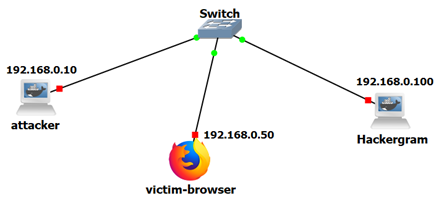

# Lab Setup

The Hackergram laboratory can be deployed locally in two ways: using **GNS3** for a network-simulated environment, or **standalone** without GNS3. Both approaches rely on Docker, so having Docker installed is a prerequisite. Alternatively, the source code can be obtained directly from the [GitHub repository](https://github.com/netexperiments/websecurity/tree/main){:target="_blank"}.

## Prerequisites

Before setting up the lab environment, if you want to use it via GNS3 ensure you have the following components installed and configured:

- **GNS3**: The main network simulation platform must be installed on your host system
- **GNS3VM**: The GNS3 Virtual Machine should be installed and configured on VMware (recommended virtualization platform for optimal performance and compatibility)
- **VMware**: VMware Workstation (Windows/Linux) or VMware Fusion (macOS) is the recommended hypervisor for running GNS3VM

## Lab Environment

The lab experiments will be explained using GNS3 VM. The network scenario for the experiments is shown in the following Figure. Another alternative is to use it locally by installing the adequate docker containers and requirements.



The Hackergram Web application is implemented with a Docker container available at the Docker Hub. For the Hackergram, install at GNS3 the container [0xdrogon/hackergram](https://hub.docker.com/r/0xdrogon/hackergram). For the attacker, install at GNS3 the container [0xdrogon/hackergram-attacker](https://hub.docker.com/r/0xdrogon/hackergram-attacker). For the victim-browser use the webterm of GNS3.


## Simple Hackergram

To facilitate the introduction of key concepts, a simplified version of the application, **Simple Hackergram**, has been developed. This version of the laboratory includes only a subset of the vulnerabilities and attack scenarios, and it requires fewer computational resources and dependencies. It is intended as a preparatory step before progressing to the full-featured Hackergram environment.

## GNS3 Lab Configuration

??? note "GNS3 Setup Script"

    Before setting up the lab topology, you need to add the required Docker containers to GNS3:

    1. **Add the Hackergram Attacker container:**
       - In GNS3, go to the settings/preferences
       - Navigate to Docker containers section
       - Add the container: `0xdrogon/hackergram-attacker`

    2. **Add the Hackergram application container:**
       - In the same Docker containers section
       - Add the container: `pimz23/hackergram30` (available at https://hub.docker.com/repository/docker/pimz23/hackergram30)

    Once both containers are added to GNS3, you can proceed with creating the lab topology using these containers. 

    Ensure that both GNS3 and the GNS3 VM are running, then execute the script `HackergramLabTopology.py` shown below. Replace the GNS3 VM password on line 8 with your own. You can usually find it in the `gns3_server.ini` file located at `C:\Users\YourUser\AppData\Roaming\GNS3\2.2\gns3_server.ini`.

    ```python

    import requests
    import time
    import subprocess

    # GNS3 Server API Endpoint
    GNS3_SERVER = "http://localhost:3080/v2"
    USERNAME = "admin"
    PASSWORD = "uhl128OLIQi8gI4BpJC9vsb2sHOXejqsUKsJrVO9nifTXJbB5WmPh5qoTGtqtLUo"
    TEMPLATES = None

    # GNS3 Authentication
    auth = (USERNAME, PASSWORD)

    # Project and container settings
    PROJECT_NAME = "gns3_hackergram_lab"
    DOCKER_IMAGE = "pimz23/hackergram2.3:latest"

    def get_project_id():
        """Check if a project with the given name exists and return its ID."""
        response = requests.get(f"{GNS3_SERVER}/projects", auth=auth)
        response.raise_for_status()
        
        projects = response.json()
        for project in projects:
            if project["name"] == PROJECT_NAME:
                return project["project_id"]
        return None

    def delete_project(project_id):
        """Delete an existing project by ID."""
        requests.delete(f"{GNS3_SERVER}/projects/{project_id}", auth=auth).raise_for_status()
        print(f"Deleted existing project: {PROJECT_NAME}")

    def create_project(custom_name=None):
        """Create a new GNS3 project"""
        project_name = custom_name if custom_name else PROJECT_NAME
        response = requests.post(f"{GNS3_SERVER}/projects", json={"name": project_name}, auth=auth)
        response.raise_for_status()
        project_data = response.json()
        print(f"Project UUID: {project_data['project_id']}")
        return project_data["project_id"]

    def add_switch(project_id):
        """Add an Ethernet switch"""
        try:
            print("Adding Ethernet switch...")
        switch_config = {
                "name": "Lab_Switch",
            "node_type": "ethernet_switch",
            "compute_id": "vm",  
            "x": 0, "y": 0
        }
        response = requests.post(f"{GNS3_SERVER}/projects/{project_id}/nodes", json=switch_config, auth=auth)
            
            if response.status_code != 201:
                print(f"ERROR: Failed to create switch. Status: {response.status_code}")
                print(f"Response: {response.text}")
                return -1
                
            switch_id = response.json()["node_id"]
            print(f"Successfully created switch with ID: {switch_id}")
            return switch_id
            
        except requests.RequestException as e:
            print(f"Failed to add switch: {e}")
            if 'response' in locals():
                print(f"Status code: {response.status_code}")
                print(f"Response content: {response.text}")
            return -1

    def get_docker_image(template_id):
    	global TEMPLATES
    	for template in TEMPLATES:
    		if template["template_id"]==template_id:
    			return template["image"]
    	print(f"Template {template_id} docker image not found")
    	return -1

    def get_templates():
        global TEMPLATES
        try:
            templates = requests.get(f"{GNS3_SERVER}/templates", auth=auth)
            templates.raise_for_status()
            TEMPLATES = templates.json()
            print(f"Retrieved {len(TEMPLATES)} templates")
            return TEMPLATES
        except requests.RequestException as e:
            print(f"Error retrieving templates: {e}")
            TEMPLATES = []
            return []

    def get_template_id(template_name):
        global TEMPLATES
        
        if not TEMPLATES:
            get_templates()
        
        for template in TEMPLATES:
            if template_name.lower() == template["name"].lower():
                print(f"Found template: {template['name']} (ID: {template['template_id']})")
                return template["template_id"]
        
        print(f"Template '{template_name}' not found. Available templates:")
        for template in TEMPLATES:
            print(template["name"])
        return None

    def add_docker_container(project_id, container_name, template_id, image=None, x=0, y=0):
        """Add a Docker container using the specified template"""
        try:
            print(f"Adding container '{container_name}' with template ID: {template_id}")
            
            # Check if template_id is valid
            if template_id is None:
                print(f"ERROR: Template ID is None for container '{container_name}'")
                return -1
            
            # Step 1: Create node from template
            node_data = {"x": x, "y": y, "name": container_name}
            response = requests.post(f"{GNS3_SERVER}/projects/{project_id}/templates/{template_id}", 
                                   json=node_data, auth=auth)
            
            if response.status_code != 201:
                print(f"ERROR: Failed to create node from template. Status: {response.status_code}")
                print(f"Response: {response.text}")
                return -1

            data = response.json()
            node_id = data["node_id"]
            print(f"Successfully created node with ID: {node_id}")
            
            return node_id
            
        except requests.RequestException as e:
            print(f"Failed to add container '{container_name}': {e}")
            if 'response' in locals():
                print(f"Status code: {response.status_code}")
                print(f"Response content: {response.text}")
            return -1
        except Exception as e:
            print(f"Unexpected error adding container '{container_name}': {e}")
            return -1

    def start_node(project_id, node_id):
        """Start a GNS3 node"""
        requests.post(f"{GNS3_SERVER}/projects/{project_id}/nodes/{node_id}/start", auth=auth).raise_for_status()

    def list_all_templates():
        try:
            response = requests.get(f"{GNS3_SERVER}/templates", auth=auth)
            response.raise_for_status()
            templates = response.json()
            print("Installed Templates:")
            for template in templates:
                template_type = template.get('template_type', 'unknown')
                compute_id = template.get('compute_id', 'unknown')
                print(f"- Name: {template['name']} (ID: {template['template_id']}) [Type: {template_type}, Compute: {compute_id}]")
            print(f"\nTotal Templates: {len(templates)}")
            return templates
        except Exception as e:
            print(f"Error retrieving templates: {e}")
            return []

    def debug_template_details(template_id):
        """Get detailed information about a specific template"""
        try:
            response = requests.get(f"{GNS3_SERVER}/templates/{template_id}", auth=auth)
            response.raise_for_status()
            template = response.json()
            print(f"Template Details for {template_id}:")
            for key, value in template.items():
                print(f"  {key}: {value}")
            return template
        except Exception as e:
            print(f"Error getting template details: {e}")
            return None

    def list_compute_engines():
        """List available compute engines"""
        try:
            response = requests.get(f"{GNS3_SERVER}/computes", auth=auth)
            response.raise_for_status()
            computes = response.json()
            print("Available Compute Engines:")
            for compute in computes:
                print(f"- ID: {compute['compute_id']}, Name: {compute['name']}, Connected: {compute['connected']}")
            return computes
        except Exception as e:
            print(f"Error getting compute engines: {e}")
            return []

    def add_note(project_id, text, x=0, y=0, font_size=12, color="#000000"):
        """Add a text note/label to the topology at specified coordinates"""
        try:
            print(f"Adding note '{text}' at position ({x}, {y})")
            
            # Create SVG text element - GNS3 expects SVG format
            svg_content = f'<svg height="{font_size + 5}" width="{len(text) * font_size // 2}"><text x="0" y="{font_size}" fill="{color}" font-size="{font_size}" font-family="Arial">{text}</text></svg>'
            
            note_data = {
                "x": x,
                "y": y,
                "z": 1,  # Layer (higher z values appear on top)
                "rotation": 0,
                "svg": svg_content
            }
            
            response = requests.post(f"{GNS3_SERVER}/projects/{project_id}/drawings", 
                                   json=note_data, auth=auth)
            
            if response.status_code == 201:
                drawing_id = response.json()["drawing_id"]
                print(f"Successfully added note with ID: {drawing_id}")
                return drawing_id
            else:
                print(f"Failed to add note. Status: {response.status_code}")
                print(f"Response: {response.text}")
                return None
                
        except requests.RequestException as e:
            print(f"Error adding note: {e}")
            return None

    def add_multiple_notes(project_id, notes_list):
        """Add multiple notes to the topology
        
        Args:
            project_id: GNS3 project ID
            notes_list: List of dictionaries with note parameters
                       [{"text": "Note text", "x": 0, "y": 0, "font_size": 12, "color": "#000000"}, ...]
        """
        note_ids = []
        for note in notes_list:
            note_id = add_note(
                project_id, 
                note.get("text", ""), 
                note.get("x", 0), 
                note.get("y", 0),
                note.get("font_size", 12),
                note.get("color", "#000000")
            )
            if note_id:
                note_ids.append(note_id)
        
        print(f"Added {len(note_ids)} notes to the topology")
        return note_ids

    def create_webterm_template():
        """Create a webterm template using a common webterm Docker image"""
        # First, check what compute engines are available and find the best one
        computes = list_compute_engines()
        
        # Prefer 'vm' compute if available (for consistency with other containers), otherwise use 'local'
        compute_id = "local"  # default
        for compute in computes:
            if compute['compute_id'] == 'vm' and compute['connected']:
                compute_id = "vm"
                break
        
        print(f"Using compute engine: {compute_id}")
        
        # Try different webterm images in order of preference
        webterm_images = [
            "gns3/webterm:latest",
        ]
        
        for image in webterm_images:
            try:
                print(f"Trying to create WebTerm template with image: {image}")
                
                # Adjust console settings based on image
                if "ubuntu" in image.lower():
                    console_type = "telnet"
                    console_http_port = None
                    console_http_path = None
                else:
                    console_type = "http"
                    console_http_port = 3000 
                    console_http_path = "/"
                
                template_data = {
                    "name": "webterm",
                    "template_type": "docker",
                    "compute_id": compute_id,
                    "image": image,
                    "console_type": console_type,
                    "adapters": 1,
                    "start_command": "",
                    "environment": "",
                    "extra_hosts": "",
                    "extra_volumes": []
                }
                
                # Add HTTP console settings only for web terminals
                if console_type == "http":
                    template_data["console_http_port"] = console_http_port
                    template_data["console_http_path"] = console_http_path
                
                response = requests.post(f"{GNS3_SERVER}/templates", json=template_data, auth=auth)
                
                if response.status_code == 201:
                    template_id = response.json()["template_id"]
                    print(f"Successfully created WebTerm template with ID: {template_id} using image: {image}")
                    return template_id
                else:
                    print(f"Failed with image {image}. Status: {response.status_code}")
                    continue 
                    
            except requests.RequestException as e:
                print(f"Error with image {image}: {e}")
                continue  # Try next image
        
        print("Failed to create WebTerm template with any available image")
        return None

    def connect_nodes(project_id, node1_id, node1_port, node2_id, node2_port):
        """Connect two nodes directly"""
        try:
            connection_data = {
                "nodes": [
                    {
                        "adapter_number": 0,
                        "node_id": node1_id, 
                        "port_number": node1_port
                    },
                    {
                        "adapter_number": 0,
                        "node_id": node2_id, 
                        "port_number": node2_port
                    }
                ]
            }
            
            response = requests.post(
                f"{GNS3_SERVER}/projects/{project_id}/links", 
                json=connection_data, 
                auth=auth
            )
            response.raise_for_status()
            print(f"Connected node {node1_id} to node {node2_id}")
        except requests.RequestException as e:
            print(f"Failed to connect nodes: {e}")
            if hasattr(e, 'response'):
                print(f"Response content: {e.response.text}")

    def start_node(project_id, node_id):
        """Start a GNS3 node"""
        try:
            response = requests.post(
                f"{GNS3_SERVER}/projects/{project_id}/nodes/{node_id}/start", 
                auth=auth
            )
            response.raise_for_status()
            print(f"Started node {node_id}")
        except requests.RequestException as e:
            print(f"Failed to start node {node_id}: {e}")

    def create_startup_script_for_containers():
        """Create startup scripts that will configure IPs when containers boot"""
        try:
            print("Creating container startup IP configuration...")
            
            # Create a script that can be executed inside containers
            startup_script = '''#!/bin/bash
    # Container IP Configuration Script

    echo "Configuring container network..."

     # Function to configure IP for current container
    configure_ip() {
        local ip_address=$1
        echo "Setting IP address to $ip_address"
        
        # Remove any existing IP configuration
        ip addr flush dev eth0 2>/dev/null || true
        
        # Configure new IP address
        ip addr add $ip_address/24 dev eth0
        ip link set eth0 up
        
        echo "IP configuration complete: $ip_address"
    }

    # Check hostname or container name to determine IP
    HOSTNAME=$(hostname)
    case "$HOSTNAME" in
        *hackergram*|*Hackergram*)
            configure_ip "192.168.0.10"
            ;;
        *attacker*|*Attacker*)
            configure_ip "192.168.0.100"
            ;;
        *zap*|*ZAP*|*novnc*)
            configure_ip "192.168.0.20"
            ;;
        *webterm*|*WebTerm*)
            configure_ip "192.168.0.50"
            ;;
        *)
            echo "Unknown container type: $HOSTNAME"
            echo "Please configure IP manually"
            ;;
    esac
    '''
            
            with open("container_ip_config.sh", "w") as f:
                f.write(startup_script)
            
            import os
            os.chmod("container_ip_config.sh", 0o755)
            print("Created container_ip_config.sh script")
            return True
            
        except Exception as e:
            print(f"Failed to create startup script: {e}")
            return False

    def get_container_docker_info(project_id, node_id):
        """Get Docker container information for direct configuration"""
        try:
            # Get node information from GNS3
            response = requests.get(f"{GNS3_SERVER}/projects/{project_id}/nodes/{node_id}", auth=auth)
            if response.status_code == 200:
                node_info = response.json()
                container_id = node_info.get('properties', {}).get('container_id')
                return container_id
            return None
        except Exception as e:
            print(f"Failed to get container info: {e}")
            return None

    def configure_container_network(project_id, node_id, container_name, ip_address):
        """Configure network settings for a Docker container"""
        try:
            print(f"Attempting to configure {container_name} with IP {ip_address}")
            
            # Get container ID
            container_id = get_container_docker_info(project_id, node_id)
            
            if container_id:
                print(f"Found container ID: {container_id}")
                print(f"To manually configure this container, run:")
                print(f"  docker exec {container_id} ip addr add {ip_address}/24 dev eth0")
                print(f"  docker exec {container_id} ip link set eth0 up")
            else:
                print(f"Could not retrieve container ID for {container_name}")
                
            # Since GNS3 API doesn't support direct IP configuration,
            # we'll provide instructions for manual configuration
            print(f"Note: Automatic IP configuration via GNS3 API is not supported.")
            print(f"Use the GNS3 GUI to configure {container_name} manually:")
            print(f"  1. Right-click {container_name} → Edit config")
            print(f"  2. Set static IP: {ip_address}/24")
            print(f"  3. Netmask: 255.255.255.0 (no gateway needed)")
            print(f"  4. Save and restart container")
            
            return True
            
        except Exception as e:
            print(f"Error with {container_name}: {e}")
            return False

    def set_node_ip(project_id, node_id, ip_cidr, ifname="eth0"):
        """Configure IP address by sending commands to the container console"""
        try:
            print(f"Configuring IP {ip_cidr} for node {node_id}")
            
            # Commands to configure IP address
            commands = [
                f"ip link set {ifname} up",
                f"ip addr flush dev {ifname}",
                f"ip addr add {ip_cidr} dev {ifname}",
            ]
            
            # Send each command to the node's console
            for cmd in commands:
                try:
                    # Send command via console
                    console_data = {"command": cmd + "\n"}
                    response = requests.post(
                        f"{GNS3_SERVER}/projects/{project_id}/nodes/{node_id}/console/send",
                        json=console_data,
                        auth=auth
                    )
                    
                    if response.status_code == 200:
                        print(f"  ✓ Executed: {cmd}")
                    else:
                        print(f"  ✗ Failed: {cmd} (Status: {response.status_code})")
                        
                except requests.RequestException as e:
                    print(f"  ✗ Error executing {cmd}: {e}")
            
            print(f"IP configuration completed for {ip_cidr}")
            return True
            
        except Exception as e:
            print(f"Failed to configure IP for node {node_id}: {e}")
            return False

    def main():
        existing_project_id = get_project_id()
        if existing_project_id:
            delete_project(existing_project_id)

        project_id = create_project()
        print(f"Created project: {PROJECT_NAME} (ID: {project_id})")
        
        get_templates()
        
        # Show all available templates with details
        print("\n=== All Available Templates ===")
        list_all_templates()
        
        switch_id = add_switch(project_id)
        print(f"Added Ethernet switch: {switch_id}")

        # Retrieve template IDs
        print("\n=== Retrieving Template IDs ===")
        hackergram_template_id = get_template_id("pimz23-hackergram30")  
        attacker_template_id = get_template_id("pimz23-my-gns3-attacker-2")
        zap_template_id = get_template_id("pimz23-zap-desktop-novnc")
        webterm_template_id = (get_template_id("webterm") or 
                              get_template_id("Webterm") or 
                              get_template_id("Web Terminal") or
                              get_template_id("WebTerm"))
        
        # Log which templates were found
        if zap_template_id:
            print(f"✓ Found ZAP Desktop template: {zap_template_id}")
        else:
            print("✗ ZAP Desktop template not found - will skip ZAP container")
        
        # If no webterm template found, try to create one
        if not webterm_template_id:
            print("No WebTerm template found, attempting to create one...")
            webterm_template_id = create_webterm_template()
            if webterm_template_id:
                # Refresh templates after creation
                get_templates()

        # Add containers using correct template IDs
        print("\n=== Adding Docker Containers ===")
        hackergram_node_id = add_docker_container(project_id, "Hackergram", hackergram_template_id, image=get_docker_image(hackergram_template_id), x=-400, y=200)
        attacker_node_id = add_docker_container(project_id, "Attacker", attacker_template_id, image=get_docker_image(attacker_template_id), x=400, y=200)

        # Add ZAP container if template is available
        if zap_template_id:
            zap_node_id = add_docker_container(project_id, "ZAP-Desktop", zap_template_id, image=get_docker_image(zap_template_id), x=-400, y=400)
            print(f"Added ZAP Desktop with ID: {zap_node_id}")
        else:
            zap_node_id = -1
            print("ZAP Desktop template not found, skipping ZAP creation")
        
        # Add webterm if template is available
        if webterm_template_id:
            webterm_node_id = add_docker_container(project_id, "WebTerm", webterm_template_id, x=0, y=400)
            print(f"Added WebTerm with ID: {webterm_node_id}")
        else:
            webterm_node_id = -1
            print("WebTerm template not found, skipping WebTerm creation")

        # Connect containers to the switch
        print("\n=== Connecting Nodes ===")
        port_counter = 0
        
        if hackergram_node_id != -1:
            connect_nodes(project_id, switch_id, port_counter, hackergram_node_id, 0)
            port_counter += 1
        else:
            print("Skipping Hackergram connection (container creation failed)")
            
        if attacker_node_id != -1:
            connect_nodes(project_id, switch_id, port_counter, attacker_node_id, 0)
            port_counter += 1
        else:
            print("Skipping Attacker connection (container creation failed)")
            
        if zap_node_id != -1:
            connect_nodes(project_id, switch_id, port_counter, zap_node_id, 0)
            port_counter += 1
            print("Connected ZAP Desktop to switch")
        else:
            print("Skipping ZAP Desktop connection (container creation failed)")
            
        if webterm_node_id != -1:
            connect_nodes(project_id, switch_id, port_counter, webterm_node_id, 0)
            port_counter += 1
            print("Connected WebTerm to switch")
        else:
            print("Skipping WebTerm connection (container creation failed)")

        # Start all nodes
        print("\n=== Starting Nodes ===")
        start_node(project_id, switch_id)
        
        if hackergram_node_id != -1:
        start_node(project_id, hackergram_node_id)
        else:
            print("Skipping Hackergram startup (container creation failed)")
            
        if attacker_node_id != -1:
        start_node(project_id, attacker_node_id)
        else:
            print("Skipping Attacker startup (container creation failed)")
            
        if zap_node_id != -1:
            start_node(project_id, zap_node_id)
            print("Started ZAP Desktop")
        else:
            print("Skipping ZAP Desktop startup (container creation failed)")
            
        if webterm_node_id != -1:
            start_node(project_id, webterm_node_id)
            print("Started WebTerm")
        else:
            print("Skipping WebTerm startup (container creation failed)")

        print("All nodes started and connected.")

        # Wait for containers to fully initialize before configuring IPs
        print("\n=== Waiting for containers to fully initialize ===")
        time.sleep(15)
        
        # Create IP configuration script and provide instructions
        print("\n=== Creating IP Configuration Resources ===")
        create_startup_script_for_containers()
        
        print("\n=== Container Information for Manual IP Configuration ===")
        
        if hackergram_node_id != -1:
            set_node_ip(project_id, hackergram_node_id, "192.168.0.100/24") 
        if attacker_node_id != -1:
            set_node_ip(project_id, attacker_node_id, "192.168.0.10/24")
        if zap_node_id != -1:
            set_node_ip(project_id, zap_node_id, "192.168.0.20/24")
        if webterm_node_id != -1:
            set_node_ip(project_id, webterm_node_id, "192.168.0.50/24")
            
        # Add IP address notes to the topology
        print("\n=== Adding IP Address Notes ===")
        add_note(project_id, "192.168.0.10", x=-400, y=150, font_size=12, color="#006600") 
        add_note(project_id, "192.168.0.100", x=400, y=150, font_size=12, color="#CC0000") 
        add_note(project_id, "192.168.0.20", x=-400, y=480, font_size=12, color="#CC6600")  
        add_note(project_id, "192.168.0.50", x=0, y=480, font_size=12, color="#666666")   

        print("\n=== IP Configuration Complete ===")
        time.sleep(5)
        
        print("\n" + "="*60)
        print("LAB SETUP COMPLETE!")
        print("="*60)
        print("All containers created and started")
        print("Network connections established") 
        print("Visual IP labels added to topology")
        print("Configuration script created: container_ip_config.sh")
        print("")
        print("MANUAL IP CONFIGURATION REQUIRED:")
        print("   GNS3 API doesn't support automatic IP configuration.")
        print("   Configure each container manually:")
        print("")
        print("Method 1 - Via GNS3 GUI:")
        print("   1. Right-click each container → Edit config")
        print("   2. Set static IP addresses as shown in labels")
        print("   3. Netmask: 255.255.255.0 (no gateway needed)")
        print("   4. Save and restart containers")
        print("")
        print("Method 2 - Via Docker commands:")
        print("   Use the docker exec commands shown above")
        print("")
        print("Target IP Addresses:")
        print("    - Hackergram: 192.168.0.10/24")
        print("    - Attacker: 192.168.0.100/24") 
        print("    - ZAP Desktop: 192.168.0.20/24")
        print("    - WebTerm: 192.168.0.50/24")
        print("="*60)

    if __name__ == "__main__":
        main()
    ```
